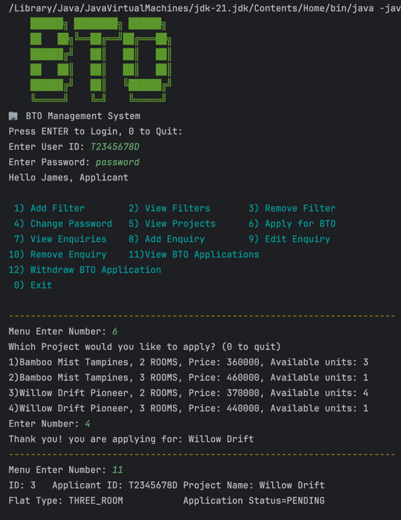

# BTO Management System

# **Build-To-Order (BTO) Management System**

BTO Management System is a system for applicants and HDB staffs to view,
apply and manage for BTO projects.

## Usage
### Built on Intellij and Eclipse IDE
**Directory for Database to access Login info and Projects:** src/main/database

**Requirements:**
JDK Version: JDK 21, External Libraries: Nil

**Open index.html to open javadoc**

